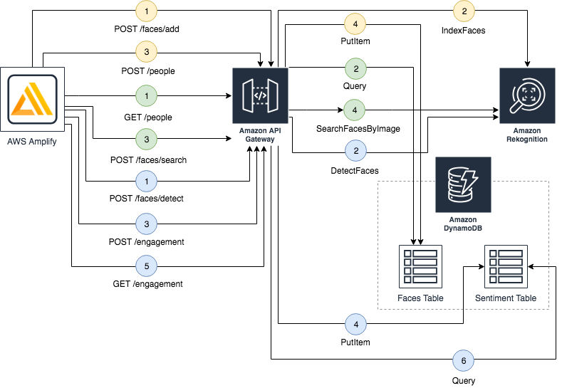

## Amazon Rekognition Engagement Meter

The Engagement Meter is a web app that calculates and shows engagement levels of an audience participating in a meeting by connecting to a webcam. It also includes the capability of recognizing the attendants by associating their faces with previously created user profiles.

This repo could be a useful playground to learn about Amazon Rekognition and other AWS services.

### Usage

The demo is available as [AWS CloudFormation](https://aws.amazon.com/cloudformation) template.
[Download the template](https://s3-eu-west-1.amazonaws.com/rekognition-engagement-meter/template.yaml) or Deploy using the AWS Console:

|Region|Launch Template|
|------|---------------|
|**US East (N. Virginia)** (us-east-1) | |
|**US East (Ohio)** (us-east-2) | |
|**US West (Oregon)** (us-west-2) | |
|**Asia Pacific (Mumbai)** (ap-south-1) | |
|**Asia Pacific (Seoul)** (ap-northeast-2) | |
|**Asia Pacific (Sydney)** (ap-southeast-2) | |
|**Asia Pacific (Tokyo)** (ap-northeast-1) | |
|**EU (Ireland)** (eu-west-1) | |

Once you have chosen a region and are inside the AWS CloudFormation Console, you should be on a screen titled "*Quick Create Stack*".

In the Stack name section, the Stack name is pre-populated with the name "*EngagementMeter*". You can customize that to a name of your choice less than 15 characters in length or leave as is.

In the Parameters section, you must provide a *CollectionId*. You can customize that to a value of your choice or leave as is.

Leave the rest of the options as is and check the "*I acknowledge that AWS CloudFormation might create IAM resources*" box and the "*I acknowledge that AWS CloudFormation might create IAM resources with custom names*" box. This is to allow CloudFormation to create a Role to allow access to resources needed by the stack and name the resources in a dynamic way.

Scroll to the bottom and click *Create Change Set* and then *Execute* to launch your stack.

Your stack will take some time to launch. You can track its progress in the "Events" tab. When it is done creating, the status will change from "*CREATE_IN_PROGRESS*" to "*CREATE_COMPLETE*".

### Architecture

The engagement meter uses [Amazon Rekognition](https://aws.amazon.com/rekognition) for image and sentiment analysis, [Amazon DynamoDB](https://aws.amazon.com/dynamodb) for storage, [Amazon API Gateway](https://aws.amazon.com/api-gateway) and [Amazon Cognito](https://aws.amazon.com/cognito) for the API, and [Amazon S3](https://aws.amazon.com/s3), [AWS Amplify](https://aws.amazon.com/amplify) and [React](https://reactjs.org) for the front-end layer.

### User flow

There are three main user flows: the **"add user"** flow (*yellow*) is triggered when clicking the *"Add user"* button; the **"added users recognition"** flow (*green*) and the **"sentiment analysis"** flow (*blue*) are triggered when clicking the *"Start Rekognition"* button and cyclically repeat until the *"Stop Rekognition"* button is clicked.

The diagram below represents the API calls performed by Amplify, which takes care of authenticating all the calls to the API Gateway using Cognito.

In the **"add user"** flow (*yellow*), Amplify makes a `POST /faces/add` request to the API gateway including the uploaded picture and an autogenerated unique identifier (known as *ExternalImageId*), then the API gateway calls the `IndexFaces` action in Amazon Rekognition. After that, Amplify makes a `POST /people` request to the API gateway including the ExternalImageId and some extra metadata (Name and Job Title), then the API gateway writes that data to the `Faces` table in Amazon DynamoDB. To learn more about *IndexFaces* click [here](https://docs.aws.amazon.com/rekognition/latest/dg/API_IndexFaces.html).

In the **"added users recognition"** flow (*green*), Amplify makes a `GET /people` request to the API gateway, which then queries the `Faces` table on Amazon DynamoDB. In case any people have been registered, Amplify makes another call to `POST /faces/search` including a screenshot detected from the webcam. Then, the API gateway calls the `SearchFacesByImage` action in Amazon Rekognition. If any previously registered person is recognized, the service provides details about the matches, including each face's coordinate and confidence. In this case, the UI shows a welcome message showing the recognized users' names. To learn more about SearchFacesByImage click [here](https://docs.aws.amazon.com/rekognition/latest/dg/API_SearchFacesByImage.html).

In the **"sentiment analysis"** flow (*blue*), Amplify makes two parallel calls to the API gateway (here represented in a sequential manner for simplicity). First, Amplify makes a `POST /faces/detect` request with a screenshot detected from the webcam to the API gateway, which then calls the `DetectedFaces` action on Amazon Rekognition. If any face is detected, the service provides details about the matches, including physical characteristics and sentiments. In that case, a little recap is shown on the UI for each recognized person. Then Amplify makes a `POST /engagement` request with some of the recognized sentiments (Angry, Confused, Happy, Sad, Surprised) to the API gateway, which writes that data to the `Sentiment` table in DynamoDB. In parallel, Amplify makes a `GET /engagement` request to the API gateway, which then queries the `Sentiment` table in DynamoDB to retrieve an aggregate for all the sentiments recorded during the last hour, in order to calibrate and draw the meter. To learn more about DetectFaces click [here](https://docs.aws.amazon.com/rekognition/latest/dg/API_DetectFaces.html).

## Contributing

Contributions are more than welcome. Please read the [code of conduct](CODE_OF_CONDUCT.md) and the [contributing guidelines](CONTRIBUTING.md).

## License Summary

This sample code is made available under a modified MIT license. See the LICENSE file.
